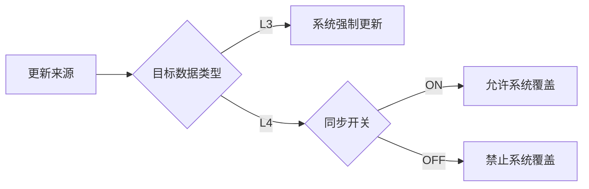

# Hotel MDM Pro 核心逻辑摘要

## 1. 数据来源 (SourceType)
- **L3 (系统同步)**: 
    - 来源：外部数据同步/导入、**服务端 RatePlan 自动同步**。
    - 权限：**只读**。
- **L4 (业务录入)**: 
    - 来源：人工手动录入。
    - 权限：**可编辑**（无论同步开关开启与否）。

## 2. 自动化逻辑 (Automation)
- **自动补全酒店 (New)**: 服务端同步各渠道（锦江/道旅/艺龙等）**RatePlan** 时，若发现关联的 **ExternalHotelId** 在系统中不存在，**自动创建 L3 酒店资源并生效**（拉取上游静态信息）。
- **自动补全房型**: 在酒店存在的前提下，若 RatePlan 关联的房型不存在，**自动创建 L3 房型并生效**。
- **数据清洗**: 服务端定期清洗数据，若匹配到可靠信源，会尝试进行数据合并/覆盖。

## 3. 房型同步开关 (Room Sync Toggle)
仅针对 **L4 (业务录入)** 房型有效，控制的是**“系统是否有权覆盖数据”**：

- **ON (开启)**: **互为覆盖模式** (Last Write Wins)。
- **OFF (关闭)**: **保护模式** (Ignore System Updates).

## 4. 冲突处理 (Conflict Handling)
- 仅针对 L4 数据与系统数据不一致，且**未开启自动同步**的场景。
- 这是一个人工决策过程（保留 vs 采纳）。

## 5. 草稿状态
- **人工草稿**: 导入/录入后未保存的数据 -> “待保存发布”。
- **系统自动数据**: RatePlan 带出来的酒店或房型 -> 默认 **“已生效”**。

## 6. 校验规则 (Validation Rules)

### 6.1 新增酒店 (Hotel Entry)
- **触发点**: [名称] 或 [地址] 输入框 **失去焦点 (OnBlur)**。
- **排重逻辑**: 
    1. **查内部库**: 若存在 -> 提示已上线 -> 引导 **[去查看]**。
    2. **查外部库**: 若存在 -> 提示有信源 -> 引导 **[一键导入]**。
- **兜底**: 点击发布时进行最终阻断校验。

### 6.2 新增房型 (Room Entry)
- **触发点**: 点击 **[保存]** 按钮。
- **唯一性指纹**: **面积 + 床型 + 窗户 + 楼层** (AND 关系)。
- **逻辑**: 若指纹完全匹配现有房型 -> **Toast 警告** (禁止/建议复用) -> 引导 **[去查看]**。

## 7. 数据标准化 (Data Standardization)

为了保证系统间对接（Mapping）的准确性，对于“酒店政策”模块中的非结构化字段进行以下枚举约束：

### 7.1 可接待人群 (Guest Policy)
前端 UI 必须强制使用下拉选择，禁止自由文本输入。对应枚举值如下：

| UI 显示文本 | 业务含义 | 适用场景 |
| :--- | :--- | :--- |
| **接待外宾** | All Allowed | 具备涉外资格的酒店，无限制 (Default) |
| **仅接待大陆和港澳台客人** | Mainland, HK, MO, TW | 不具备接待外籍人士资格，但可接待港澳台同胞 |
| **仅接待大陆客人** | Mainland Only | 仅限持中国大陆身份证客人入住 |

### 7.2 前台服务时间 (Front Desk Hours)
- 类型：String
- 格式建议：
  - 全天候服务填写：`24小时`
  - 非全天候填写时间段：`08:00 - 22:00`
